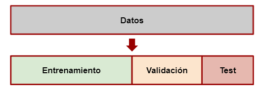

## Detección del Fraude

Carga de las librerias necesarias

```{r, message=FALSE}
# Carga de paquetes necesarios
knitr::opts_chunk$set(echo = TRUE)
knitr::opts_chunk$set(message = FALSE)
knitr::opts_chunk$set(warning = FALSE)
library(tidyverse)
library(discrim)
library(tidymodels)
library(workflows)
```

```{r}
set.seed(14)

df <- read_csv('C:/Users/Pame/Desktop/intro_ia_pda/data/df_fraude.csv') %>% 
        sample_n(15000) %>% 
        select ("gender", "amount", "fraud", "category", "age")
```

### Descripción de las variables

-   `Step`: representa el día en que la transacción sucede. En total son 180 *steps*, por lo que la base de datos es por 6 meses.

-   `Customer`: representa el ID de la persona que inicia la transacción. Está formada con la letra C seguida por una secuencia unica de 10 numeros.

-   `Age`: esta variable se divide en intervalos de edad, comenzando de 0 a 6 y la letra U que significa *Unknown*. La edad es *Unknow* solo para las transacciones que tienen el mismo género que *Enterprise*. La codificación de los números es:

    -   0: menor a 18 años
    -   1: entre 19 y 25 años
    -   2: entre 26 y 35 años
    -   3: entre 36 y 45 años
    -   4: entre 46 y 55 años
    -   5: entre 56 y 65 años
    -   6: mayor a 65 años

-   `Gender`: esta variable se codifica como F para Mujer, M para Hombre, E para Empresa y U para *Unknown*.

-   `Merchant`: esta variable representa la identificación única de la parte que recibe la transacción. Similar a la identificación del cliente, la secuencia está formada por la letra M, seguida de una serie de 9 números. Hay un total de 50 comerciantes únicos en el conjunto de datos.

-   `Category`: hay 15 categorías únicas que etiquetan el tipo general de transacción: transporte, comida, salud, bienestar y belleza, moda, bares y restaurantes, hiper, deportes y juguetes, tecnología, hogar, servicios de hotel, otros servicios, contenidos, viajes, ocio.

-   `Amount`: representa el valor de la transacción. Solo hay 52 valores iguales a 0 y ningún valor negativo.

-   `Fraud`: una columna indicadora codificada con 0 si la transacción fue limpia y con 1 si la transacción fue fraudulenta.

`zipcodeOri` y `zipMerchant`: contienen un valor constante de 28007, que es un código postal en Ansonville, Carolina del Norte, Estados Unidos.

## EDA

```{r}
df$fraud <- as.factor(df$fraud)
df$age <- as.factor(df$age)
df$gender <- as.factor(df$gender)
df$category <- as.factor(df$category)

glimpse (df)
```

Para una correcta interpretación de nuestros resultados vamos a especificar que `1` es nuestra clase positiva (cliente quiere contratar un seguro)

```{r}
df$fraud <- relevel(df$fraud, ref = "1")
levels(df$fraud)
```

## División del dataset: Entrenamiento y testeo

{.fragment width="500" lenght="700" fig-align="center"}

```{r}
set.seed(456)#setear la semilla
# Create data split for train and test
df_split <- initial_split(df,
                          prop = 0.7,
                          strata = fraud)# para conservar la proporción de clases
# Create training data
df_train <- df_split %>%
              training()
# Create testing data
df_test <- df_split %>%
              testing()
# Number of rows in train and test dataset
paste0("Total del dataset de entrenamiento: ", nrow(df_train))
paste0("Total del dataset de testeo: ", nrow(df_test))
```

## Entrenando modelos con `Tidymodels`

> <i class='fas fa-code-branch pr2'></i> Si no tenés instalado `tidymodels` podés hacerlo corriendo el siguiente código

``` r
install.packages("tidymodels")
```

Al igual que `tidyverse`, `tidymodels` está compuesto por un conjunto de paquetes como los siguientes:

-   `rsample`: para realizar la división del dataset en entrenamiento, validación y testeo.

-   `recipes`: para el preprocesamiento

-   `parnship`: para especificar el modelo

-   `yardstick`: para evaluar el modelo

Mayores especificaciones y ejemplos de uso de `tidymodels`, en su [página](https://www.tidymodels.org/packages/)


## Preprocesamiento de datos usando `recipe`

```{r}
recipe_df <-  recipe (fraud ~ ., data= df_train) |>  
              step_scale(all_numeric_predictors()) |> 
              step_dummy(all_nominal_predictors())
              
# Bake
df_train <- bake(recipe_df|> 
              prep(), new_data=df_train)
df_test <- bake(recipe_df|> 
              prep(), new_data=df_test)
```

## Especificando el modelo

Se puede entrenar cualquier modelo (que este incluído en `tidymodels`) siguiendo los pasos que se muestran a continuación.

1- Especificar el modelo (eg. Regresión logística, Random Forest, SVM, etc)

2- Con `set_engine()` se especifíca la familia de modelos

3- Con `set_mode()` se especifica el tipo de modelo a entrenarse (regresión o clasificación)

4- Usar la función `fit ()` para entrenar el modelo y, dentro de eso, debe proporcionar la notación de la fórmula y el conjunto de datos

# Random Forest con CV

Con `tune`, se especifica qué hiperparámetros van a ser tuneados.

```{r}
#Random forest con validacion cruzada
set.seed(234)
model_RF <- rand_forest(mtry = tune(), 
                         min_n = tune(),
                         trees = 50) %>%    
             set_mode("classification")
```

## Uniendo todo en un *Workflow*

```{r}
wf_RF <- workflow() |>  
          add_recipe(recipe_df) |> 
          add_model(model_RF)
wf_RF
```

## Cross-validation

{fig-align="center"}

```{r}
set.seed(1234)
fold_df <- vfold_cv(df_train, v=5)
fold_df$splits
```

Necesitamos un conjunto de posibles valores de parámetros para probar el árbol de decisión.

```{r}
param_grid <- grid_regular(mtry(range = c(10, 30)), 
                           min_n(range = c(2, 8)))
param_grid
```


{.fragment width="500" lenght="700" fig-align="center"}

Si la prioridad es predecir correctamente a los positivos --> buscamos alta sensibilidad

Si se quiere identificar correctamente a los negativos --> buscamos alta especificidad

```{r}
doParallel::registerDoParallel() #paralelizamos los cálculos

tune_DF <- tune_grid(
  model_RF,
  fraud~ .,
  resamples = fold_df, 
  grid = param_grid, 
  metrics = metric_set(accuracy, roc_auc, precision)
)
```

Las métricas provienen del rendimiento de la validación cruzada a través de los diferentes valores de los parámetros.

```{r}
collect_metrics(tune_DF)
```

```{r}
autoplot(tune_DF)
```

## Selección del mejor modelo

```{r}
param_final <- tune_DF |> 
  select_best(metric = "precision")
param_final
```


```{r}
wf_RF <- wf_RF |> 
  finalize_workflow(param_final)
wf_RF
```

# Evaluación en test

A continuación, se ajusta el flujo de trabajo del modelo final a los datos de entrenamiento y se evalúa el rendimiento en los datos de testeo.

La función ´last_fit()´ ajuta el flujo de trabajo a los datos de entrenamiento y generará predicciones sobre los datos de prueba según lo define nuestro objeto churn_split.

```{r}
dt_fit <- wf_RF |> 
  # fit on the training set and evaluate on test set
  last_fit(df_split, metrics = metric_set(precision))
dt_fit
```


```{r}
test_performance <- dt_fit |>  collect_metrics()
test_performance
```

## Matriz de confusion

```{r}
collect_predictions(dt_fit) |> 
  conf_mat(fraud, .pred_class)
```

```{r}
final_RF <- extract_workflow(dt_fit)
final_RF
```

## ¿Cuáles fueron las variables más importantes?

```{r}
best_precision <- select_best(tune_DF, metric= "precision")

final_rf <- finalize_model(
  model_RF,
  best_precision
)
```

```{r}
library(vip)

final_rf %>%
  set_engine("ranger", importance = "permutation") %>%
  fit(fraud ~ .,
    data = df_train
  )%>%
  vip()
```

# Predecir un nuevo caso

```{r}
# Crear un nuevo caso de ejemplo
nuevo_caso <- data.frame(
  gender = "'M'",
  amount = 600.2,
  category= "'es_fashion'",
  age= "'5'"
)

# Predecir con el modelo final
prediccion <- predict(final_RF, nuevo_caso)

prediccion

```


